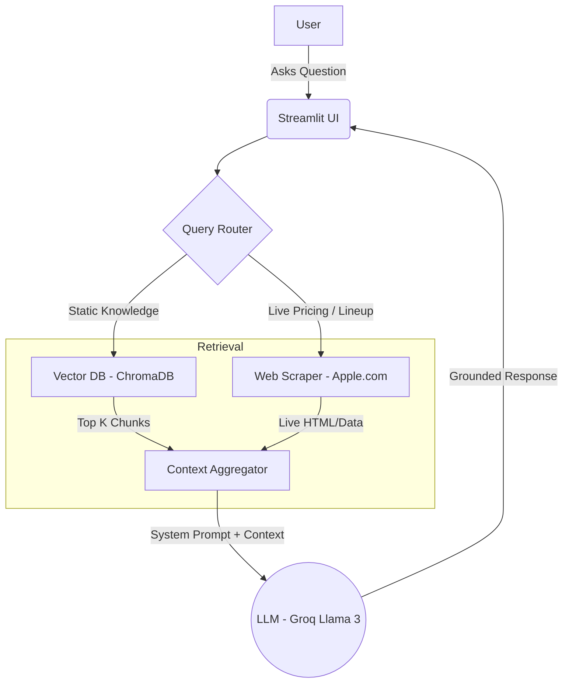

# Apple Watch Assistant ⌚️

A rigorously tested **Retrieval-Augmented Generation (RAG) AI Assistant** featuring a hybrid search pipeline for answering queries related to Apple Watches. This project focuses not just on building a RAG prototype, but on measuring and evaluating its performance in real-world scenarios.

---

## 1. What We Built
This project is an end-to-end LLM chat assistant that leverages Apple Watch documentation and live data to answer user queries without hallucinating. It features:
* **Streamlit UI:** A responsive chat interface.
* **Intelligent Query Router:** Uses keyword extraction to classify queries into static PDF knowledge, live web data, or hybrid comparisons.
* **Hybrid Retrieval:** Combines Semantic Vector Search (ChromaDB) with a Live Web Scraper (Apple India store).
* **Evaluation Framework:** A custom 3-dimensional testing suite that automatically scores the bot on Groundedness, Faithfulness, and Completeness using an LLM-as-a-judge.

---

## 2. Architecture Diagram



---

## 3. Evaluation Methodology & Results

This project features a fully isolated `evals/` directory to measure the system's accuracy. We evaluate the RAG pipeline across 3 dimensions:

### Dimension 1: Router Accuracy (Automated Unit Tests)
* **Methodology:** `pytest` tests evaluating if the deterministic logic correctly triggers `needs_pdf` or `needs_web`.
* **Results:** **36/36 passed.** Found and documented edge cases (e.g., "What is the best iPhone" triggers a comparison intent but shouldn't hit Watch PDFs).

### Dimension 2: Retrieval Quality (Automated Unit Tests)
* **Methodology:** Tests asserting that ChromaDB returns chunks with an acceptable cosine distance (`< 1.2`) and that those chunks contain the expected semantic keywords.
* **Results:** **15/15 passed.** 

### Dimension 3: Response Quality (LLM-as-a-Judge)
* **Methodology:** We pass 15 curated "golden test" queries through the full pipeline. The generated response + context is fed back into an LLM (Groq) to grade Groundedness, Faithfulness, and Completeness on a 1-5 scale.
* **Discussion of Results:**
  * **Static PDF Queries:** Excellent performance (**5.0/5.0**). The chatbot successfully retrieves context for queries like "What is ECG?" and sticks strictly to the facts.
  * **Comparisons:** Strong performance (**~4.3/5.0**) when comparing older models (e.g., SE vs Ultra).
  * **Live Web Queries:** Poor performance (**Average 1.89/5.0**). We discovered that when the Apple India web scraper fails to extract a verified price due to DOM layout changes, the LLM ignores its strict prompt and hallucinates realistic-sounding but fake prices (e.g., ₹46,900 for Series 11). 
  * **Actionable Takeaway:** This evaluation proves the necessity of a stricter prompt ("If context is empty, refuse to guess") and a more resilient scraper regex.

---

## 4. Technical Decisions & Choices

* **Streamlit for UI:** Chosen for its rapid prototyping capabilities, allowing us to build a functional, interactive chat interface in pure Python without managing a separate React frontend.
* **Hybrid Context (Vector + Live Scrape):** Vector DBs are great for manuals but terrible for "What is the price today?". Dynamically routing price/lineup questions to a live scraper ensures the LLM gets the most up-to-date data.
* **RAG over Fine-tuning:** Apple Watch lineups update yearly. We opted for RAG because it allows us to easily drop new PDFs into the database and update scraper logic, completely avoiding the expensive and complex process of retraining model weights.
* **LLM-as-a-Judge:** Traditional NLP metrics (BLEU/ROUGE) do not correlate well with human judgment for RAG chats. Using a strong LLM to grade responses on specific rubrics provides actionable, CV-worthy metrics.

---

## 5. Setup Instructions

1. **Clone the repository:**
   ```bash
   git clone https://github.com/YourUsername/apple-watch-assistant.git
   cd apple-watch-assistant
   ```

2. **Install dependencies:**
   ```bash
   pip install -r requirements.txt
   ```

3. **Set up Environment Variables:**
   You can export your Groq API Key directly in the terminal:
   ```bash
   export GROQ_API_KEY="your_api_key_here"
   ```
   Alternatively, you can create a `.env` file from the example:
   ```bash
   cp .env.example .env
   ```

4. **Run the App:**
   ```bash
   streamlit run app.py
   ```

5. **Run the Evaluations (Optional):**
   ```bash
   pytest evals/test_router.py -v
   pytest evals/test_retrieval.py -v
   python evals/eval_responses.py
   ```
